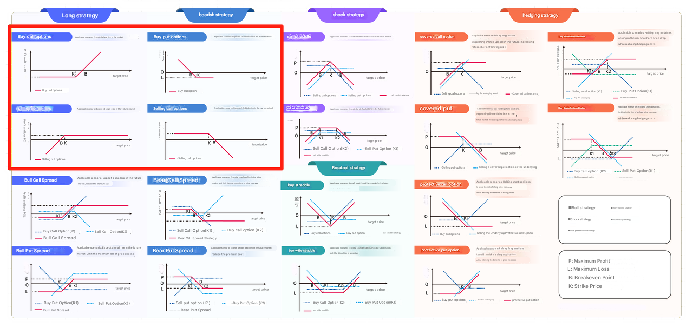
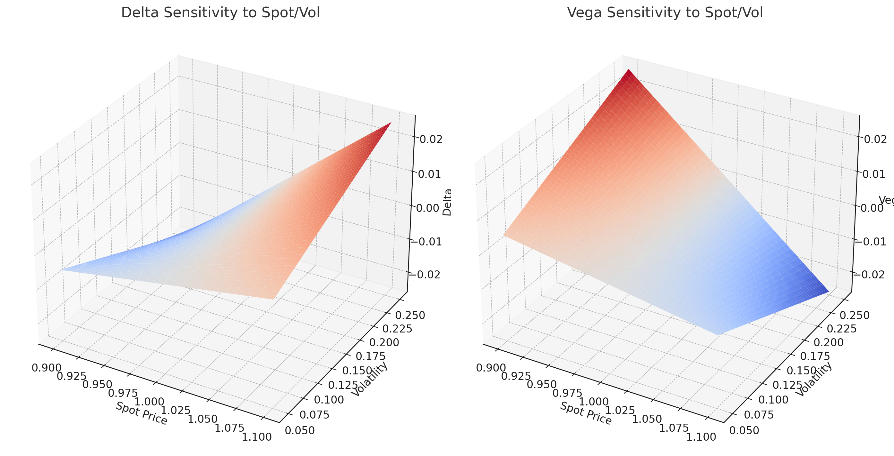

# ETAAcademy-3D: 01. Derivatives

<table>
  <tr>
    <th>title</th>
    <th>tags</th>
  </tr>
  <tr>
    <td>01. Derivatives</td>
    <td>
      <table>
        <tr>
          <th>Finance</th>
          <th>basic</th>
          <td>Derivatives</td>
        </tr>
      </table>
    </td>
  </tr>
</table>

[Github](https:github.com/ETAAcademy)｜[Twitter](https:twitter.com/ETAAcademy)｜[ETA-Finance](https://github.com/ETAAcademy/ETAAcademy-Finance)

Authors: [Evta](https:twitter.com/pwhattie), looking forward to your joining

# Financial Derivatives: Futures, Options, and Forwards

Financial derivatives are instruments that derive their value from underlying assets or benchmark, including commodities, currencies, stocks,interest rates, crypto, etc. This article provides an overview of futures, options, forwards, and swaps, explaining their structure, applications, and key features:

- **Risk Management**: Companies and individuals use futures to hedge against price volatility in the spot market, stabilizing their financial planning.
- **Price Discovery**: Futures prices reflect collective market expectations regarding the future value of the underlying asset.
- **Speculation**: Traders leverage price fluctuations in the futures market to generate profits.
- **Leverage**: By using a margin system, investors can control larger positions with a smaller capital outlay, amplifying both potential gains and losses.

## 1. Futures Contracts

Futures contracts are a cornerstone of the financial derivatives market, offering participants a mechanism to hedge risk, discover prices, and engage in speculative trading. These standardized contracts obligate buyers and sellers to transact a specified quantity of an underlying asset at a predetermined price on a future date. Traded on centralized exchanges like the Chicago Mercantile Exchange (CME), futures contracts are known for their transparency, liquidity, and accessibility.

1. **Underlying Assets**: Futures contracts can be based on commodities (e.g., agricultural products, energy, metals) or financial instruments (e.g., stock indices, foreign currencies, interest rates).
2. **Settlement Methods**: They may settle via **physical delivery**, where the actual underlying asset is exchanged, or through **cash settlement**, where the transaction resolves by paying the price difference.
3. **Initial Value**: When a futures contract is initiated, its value is zero.
4. **Daily Settlement (Mark-to-Market)**: Futures positions are marked to market daily, resetting their value to zero after each settlement.
5. **Value Between Settlements**: The value of a futures contract may deviate from zero between daily settlements. For a long position, its value equals the current futures price minus the previous settlement price.

This daily settlement process ensures market stability and prevents excessive risk accumulation. Conceptually, it can be viewed as closing an expiring contract and simultaneously opening a new one with identical terms.

### Pricing and Conversion Factors in U.S. Treasury Futures

Among the most actively traded futures contracts are those based on U.S. Treasury securities. Understanding their pricing involves both the clean price of the underlying bonds and specific adjustments related to accrued interest and risk-free rates.

1. **Price Quotation**: Treasury futures are quoted based on their **clean price**, which excludes any accrued interest.

   - **Clean Price** = **Full Price** - **Accrued Interest (AI)**

2. **Futures Price Formula**: If the spot price ($S_0$) is quoted as a clean price, the futures price can be calculated as:

   $$
   FP_0 = \left( S_0 - AI_0 \times (1 + R_f)^T \right) \times CF
   $$

   Where:

   - $FP_0$: Futures price
   - $S_0$: Spot price of the Treasury security
   - $AI_0$: Initial accrued interest
   - $R_f$: Risk-free interest rate
   - $T$: Time to contract maturity (in years)
   - $CF$: Conversion factor, which standardizes the price relationship between the futures contract and the underlying Treasury bond.

The **conversion factor (CF)** is unique to U.S. Treasury futures and accounts for variations in coupon rates and maturities of deliverable bonds. By incorporating these factors, the pricing formula captures the full economic value of the futures contract, aligning it with market conditions.

---

## 2. Options

Options are a type of financial derivative that provide the buyer with the right (but not the obligation) to buy or sell an underlying asset at a predetermined price on or before a specific date. Key characteristics include:

- **Rights and Obligations:** Buyers enjoy the right to exercise the option but are not obligated to do so, while sellers are obligated to fulfill the contract if exercised.
- **Premiums:** Buyers pay an upfront premium to purchase options, while sellers earn this premium.
- **Underlying Assets:** These can include stocks, indices, commodities, or currencies.
- **Expiration Date:** The final date by which the option can be exercised.

The main purposes of options in financial markets are **risk management** (hedging against price volatility), **speculation** (profiting from price movements), and **income generation** (e.g., selling covered calls to earn premiums).

### Types of Options

1. **Call Options:** Grant the holder the right to buy the underlying asset at a specific price (strike price).
2. **Put Options:** Grant the holder the right to sell the underlying asset at a specific price.

### Pricing Options: The Black-Scholes Model

The Black-Scholes model is a classic framework used to calculate the theoretical price of European options, assuming that the price of the underlying asset follows a geometric Brownian motion.

**Call Option Pricing:**

$$
C = S_0 \cdot N(d_1) - X \cdot e^{-rT} \cdot N(d_2)
$$

**Put Option Pricing:**

$$
P = X \cdot e^{-rT} \cdot N(-d_2) - S_0 \cdot N(-d_1)
$$

Where:

$$
d_1 = \frac{\ln(S_0 / X) + (r + \sigma^2 / 2)T}{\sigma \sqrt{T}}, \quad d_2 = d_1 - \sigma \sqrt{T}
$$

**Symbols:**

- $C$: Call option price
- $P$: Put option price
- $S_0$: Current price of the underlying asset
- $X$: Strike price
- $r$: Risk-free interest rate
- $T$: Time to expiration (in years)
- $\sigma$: Volatility of the underlying asset price
- $N(d)$: Cumulative distribution function of the standard normal distribution

### Option Strategies for Different Market Scenarios

Options are versatile instruments that allow investors to design strategies based on market outlooks and volatility predictions. Below are some commonly used strategies categorized by market trends (bullish, bearish, or neutral) and volatility levels (high or low).

<div align="center"> 

</div>

#### 1. Covered Call

- **Objective:** Earn premium income by selling call options on owned stock, potentially increasing returns or selling stock near a target price.
- **Construction:** Long stock + short call option. Suitable when expecting limited price appreciation.
- **Profit/Loss:**
  $$
  \text{Profit} = (S_T - S_0) - \left[\max(0, (S_T - X)) - C\right]
  $$

#### 2. Protective Put

- **Objective:** Protect against downside risk for owned stock by purchasing put options.
- **Construction:** Long stock + long put option, effectively acting as insurance.
- **Profit/Loss:**
  $$
  \text{Profit} = (S_T - S_0) + \left[\max(0, (X - S_T)) - P\right]
  $$

#### 3. Writing Puts

- **Objective:** Earn premium by selling put options, with a readiness to buy the stock at the strike price if exercised.
- **Construction:** Short put option + cash reserved for potential purchase.
- **Use Case:** Suitable for mildly bullish outlooks or acquiring stock at a lower price.

#### 4.Bull Spread

- **Bull Call Spread:** Buy a call option with a lower strike price ($X_L$) and sell one with a higher strike price ($X_H$). Suitable for moderate bullish outlooks.
  $$
  \text{Profit} = [\max(0, (S_T - X_L)) - C_L] - [\max(0, (S_T - X_H)) - C_H]
  $$
- **Bull Put Spread:** Buy a put option with a lower strike price ($X_L$) and sell one with a higher strike price ($X_H$). Suitable for slightly bullish markets.
  $$
  \text{Profit} = [\max(0, (X_L - S_T)) - P_L] - [\max(0, (X_H - S_T)) - P_H]
  $$

#### 5. Bear Spread

- **Bear Call Spread:** Sell a call with a lower strike price ($X_L$) and buy one with a higher strike price ($X_H$). Used when expecting a slight price decline.
- **Bear Put Spread:** Sell a put with a lower strike price ($X_L$) and buy one with a higher strike price ($X_H$). Ideal for bearish scenarios.

#### 6. Calendar Spread

- **Objective:** Profit from differences in volatility between options with the same strike price but different expiration dates.
- **Structure:**
  - **Long Calendar Spread:** Buy long-term options and sell short-term options.
  - **Short Calendar Spread:** Buy short-term options and sell long-term options.

#### 7. Straddle

- **Objective:** Profit from significant price movement in either direction.
- **Structure:** Buy both a call and a put with the same strike price and expiration date.
  - **Long Straddle:** Suitable for volatile markets.
  - **Short Straddle:** Profits in stable markets by collecting premiums.

#### 8. **Collar**

- **Objective:** Protect against downside risk while capping upside potential.
- **Structure:** Long stock + Long put + Short call. Premium from the short call offsets the cost of the put option.

$$
Profit = (S_T - S_0) + \max(0, X_p - S_T) - \max(0, S_T - X_c) - P_0 + S_0
$$

#### 9. Iron Condor

Profit from low volatility by selling call and put options at two different strike prices while buying further out-of-the-money options to limit risk.

#### 10. Butterfly Spread

Profit from low volatility and price stability near the strike price. Buy one low-strike option, sell two mid-strike options, and buy one high-strike option.

Options strategies offer a wide range of possibilities, enabling investors to navigate various market scenarios with precision and flexibility. By carefully selecting the appropriate strategy, investors can optimize returns while managing risk.

## 3. Forwards

**Forward contracts** are financial derivatives representing an agreement between two parties to buy or sell an asset at a predetermined price on a specified future date. Forwards are primarily used for **hedging risks** (e.g., currency, interest rate, or commodity price volatility) and **speculation** (profiting from anticipated price changes of the underlying asset). Similar to futures, forwards are standard tools for risk management but are typically customized and traded over-the-counter (OTC).

### Forward Pricing

The pricing of a forward contract is determined by the principle of no arbitrage. This ensures that the forward price aligns with the cost of holding the underlying asset until maturity. Forward pricing is composed of two parts: the **theoretical price** and the **value at maturity**.

1. **Theoretical Price Formula:**

$$
F_0 = S_0 \times e^{r \times T}
$$

- $F_0$: Forward price
- $S_0$: Current spot price of the underlying asset
- $r$: Continuous compounding risk-free interest rate
- $T$: Time to maturity (in years)
- $e$: Euler's constant (approximately 2.718)

**Explanation:**  
The forward price equals the current spot price of the asset adjusted for the cost of capital over time (time value of money).

2. **Value at Maturity Formula:**

$$
V_T = S_T - F_0
$$

- $V_T$: Value of the forward contract at maturity
- $S_T$: Market price of the underlying asset at maturity
- $F_0$: Forward price

At maturity, the value of the forward contract is the difference between the market price of the underlying asset and the agreed-upon forward price.

The theoretical forward price can also incorporate additional costs or benefits associated with holding the underlying asset until maturity:

$$
FP = S_0 + \text{Carry Costs} - \text{Carry Benefits}
$$

- **Carry Costs:** Costs incurred for holding the asset, such as interest or storage fees.
- **Carry Benefits:** Returns from holding the asset, such as dividends or other yield.

By accounting for these factors, the pricing formula ensures fairness and prevents arbitrage opportunities.

### Valuation of Forward Contracts

1. **Zero-Coupon Bonds (Treasuries)**

Forward contracts on zero-coupon bonds can be priced and valued using the following formula:

$$
V_T = S_T - FP \times (1 + R_f)^{T - t}
$$

Where:

- $R_f$: Risk-free interest rate
- $T - t$: Time remaining until the forward contract’s maturity

This framework ensures that the value reflects the time value of money and the bond’s current price.

2. **Dividend-Paying Stocks**

For forward contracts on dividend-paying stocks, the pricing formula adjusts for the present value of dividends (PVD):

$$
FP = S_0 - \text{PVD} \times (1 + R_f)^T
$$

At maturity, the forward contract’s value can be calculated as:

$$
V_T = S_T - FP \times (1 + R_f)^{T - t}
$$

This adjustment ensures the price accounts for any expected cash flows from dividends during the contract’s life.

3. **Coupon-Paying Bonds**

Forward contracts on coupon-paying bonds resemble those on dividend-paying stocks. The cash flows here are derived from coupon payments, and the forward price is adjusted for the present value of these payments (PVC):

$$
V_t = S_t - \text{PVC} - FP \times (1 + R_f)^{T - t}
$$

4. **Forward Rate Agreements (FRAs)**

**Forward Rate Agreements (FRAs)** are specialized forward contracts involving interest rates. They enable parties to lock in borrowing or lending rates for a future period without requiring an actual loan transaction. Instead, the agreement is cash-settled at maturity based on the difference between the agreed-upon rate and the prevailing market rate.

**FRA Example: 1×4 FRA**

A **1×4 FRA** specifies the following:

- The agreement matures **in one month.**
- The underlying loan or deposit begins **in four months.**
- The loan period is **three months** (from Month 4 to Month 7).
- The agreed rate is settled based on the **30-day LIBOR rate for a 90-day period.**

FRAs are commonly used to manage interest rate risk for financial institutions and corporate treasuries, allowing them to hedge exposure without executing physical borrowing or lending.

---

## 4. Swaps

**Swaps** are financial derivatives where two parties agree to exchange a series of cash flows in the future based on predetermined terms. These cash flows are typically calculated on a notional amount and follow a fixed schedule. Common types of swaps include **interest rate swaps**, **currency swaps**, and **commodity swaps**, each serving unique purposes such as risk management, cost reduction, or asset-liability matching.

- **Interest rate swaps** involve exchanging fixed and floating interest rate cash flows.
- **Currency swaps** involve exchanging principal and interest in different currencies.
- **Commodity swaps** involve cash flows linked to commodity prices, such as oil or gold.

### Pricing a Plain Vanilla Swap

A **plain vanilla swap** is a simple interest rate swap where one party pays a fixed interest rate while the other pays a floating rate. The goal of pricing such a swap is to determine the fixed rate (known as the **swap rate**) such that the contract has a zero net present value (NPV) at inception.

1. **Floating Rate Bonds:**  
   At the start of the swap, the value of a floating rate bond is assumed to equal its face value. This ensures the present value of floating rate cash flows matches the notional amount.

2. **Fixed Rate Bonds:**  
   The fixed rate bond’s value is calculated using the following formula for the fixed coupon rate ($C$):

   $$
   C = \frac{1 - B_n}{B_1 + B_2 + \cdots + B_n}
   $$

   Where:

   - $C$: Fixed coupon rate
   - $B_n$: Discount factor for period $n$, representing the present value of $1 in the future

This ensures that the present value of fixed payments equals the notional principal.

### Managing Interest Rate Risk

The primary objective in managing interest rate risk is to hedge against fluctuations in interest rates using derivatives such as swaps, forward rate agreements (FRAs), or futures. While hedging is effective, it is not always perfect due to several factors:

1. **Cheapest-to-Deliver (CTD) Bonds:**  
   Changes in the CTD bond during the holding period can impact hedging effectiveness.

2. **Convexity Effects:**  
   The relationship between interest rates and bond prices is nonlinear, meaning price sensitivity varies with the level of interest rates.

3. **Non-Parallel Movements in the Yield Curve:**  
   Different maturities on the yield curve may shift differently, complicating hedging strategies.

**Converting Floating to Fixed Rates:**

An investor can use an **interest rate swap** to convert floating-rate liabilities into fixed-rate liabilities by paying a fixed rate and receiving a floating rate. This stabilizes borrowing costs.

**Key Calculations in Interest Rate Risk Hedging:**

1. The net cash flow difference for a fixed-rate payer is expressed as:

   $$
   D*{\text{pay-fixed}} = D*{\text{floating}} - D\_{\text{fixed}}
   $$

2. **Hedge Ratio (BPV):**  
   Basis point value (BPV) measures the sensitivity of a bond’s price to changes in interest rates. The hedge ratio (BPVHR) for interest rate risk is calculated as:

   $$
   BPVHR = \frac{BPV*T - BPV_p}{BPV*{CTD}} \times CF
   $$

   Where $CF$ is the conversion factor for the CTD bond.

### Cross-Currency Swaps

**Currency swaps** are used to manage foreign exchange (FX) risk arising from exchange rate fluctuations. They enable the exchange of principal and interest payments in different currencies, making them valuable for financing, hedging, or speculation.

- Cross-border financing: Firms borrow in one currency (e.g., USD) and swap into another currency (e.g., EUR) to reduce financing costs or mitigate currency exposure.
- Hedging: Protects against unfavorable exchange rate movements.

**Example: Managing USD and EUR Exposure**

Consider a scenario where demand for USD is high. An investor might enter a currency swap to:

1. Borrow USD while simultaneously purchasing EUR.
2. Exchange EUR for USD cash flows at periodic intervals during the swap.
3. Repay the USD principal at maturity using the equivalent EUR amount.

This process can reduce exchange rate risk while meeting cross-currency financing needs.

### Managing Equity Risk

**Equity risk** refers to the risk of financial losses due to fluctuations in stock prices or equity indices. To mitigate this, investors and corporations use equity derivatives such as total return swaps, equity futures, and options to hedge exposures, rebalance portfolios, or achieve specific financial goals.

**Total Return Swaps (TRS):**  
 A TRS allows one party to receive the total return of a specific stock or equity index (including dividends and capital gains) while paying a floating interest rate to the counterparty. This enables investors to gain market exposure without directly owning the underlying assets.

Example formula for equity hedge ratio:

$$
N_f = \frac{\beta_T - \beta_S}{\beta_f} \times \frac{S}{F}
$$

Where:

- $N_f$: Number of futures contracts
- $\beta_T$: Target portfolio beta
- $\beta_S$: Current portfolio beta
- $\beta_f$: Futures beta
- $S$: Portfolio value
- $F$: Futures price

By employing swaps and related derivatives, investors can efficiently manage their exposure to equity market volatility without liquidating or restructuring their portfolios.

---

### 5. Credit Derivatives

**Credit derivatives** are financial instruments whose value depends on changes in the credit risk of one or more underlying assets. They enable investors to manage or speculate on credit risk without directly holding the underlying assets.

- **Credit Risk Transfer:** These instruments allow for the partial or complete transfer of credit risk between buyers and sellers.
- **Underlying Credit Assets:** Include corporate bonds, loans, government bonds, and credit indices.
- **Credit Events:** Specific events defined in the contract, such as defaults or debt restructuring, trigger credit protection payments.
- **Transaction Formats:** Primarily traded over-the-counter (OTC) or via standardized clearinghouses.

### Major Types of Credit Derivatives

1. **Credit Default Swap (CDS):**

   - The most common credit derivative, a CDS allows investors to hedge against or speculate on the risk of a borrower defaulting.
   - The buyer pays periodic premiums to the seller in exchange for protection against credit events (e.g., default). If a credit event occurs, the seller compensates the buyer.

2. **Credit-Linked Note (CLN):**

   - A structured credit derivative combining debt instruments with credit derivatives, allowing investors to take on exposure to credit risk.
   - Investors bear losses if specified credit events (such as default) occur.

3. **Collateralized Debt Obligation (CDO):**
   - A CDO repackages a pool of assets with varying credit qualities into tranches, distributing the associated risk and returns to different investors.
   - It aims to diversify risk while providing higher yields but exposes market participants to complex credit risks.

### Pricing Credit Derivatives

The pricing of credit derivatives typically relies on financial models that incorporate market pricing of credit risk and the probability of credit events.

1. **Credit Default Swap (CDS) Pricing**

The premium of a CDS can be calculated using the following formula:

$$
\text{CDS Premium} = \frac{P_{\text{CDS}}}{(1 + r_{\text{Risk-Free}})^t}
$$

Where:

- $P_{\text{CDS}}$: Annual premium paid for the CDS.
- $r_{\text{Risk-Free}}$: Risk-free interest rate used to discount cash flows.
- $t$: Time to maturity of the CDS.

To refine the pricing, factors such as the **default probability** ($p_{\text{default}}$) and **recovery rate** ($R_{\text{Recovery}}$) are incorporated. Common models used for CDS pricing include the **Cox-Ingersoll-Ross (CIR) model** and the **Jarrow-Turnbull model**, which assess the probability and timing of default events.

2. **Credit-Linked Note (CLN) Pricing**

The price of a CLN is determined by combining the value of a debt instrument with an embedded credit derivative, typically a CDS. The pricing formula is as follows:

$$
P_{\text{CLN}} = P_{\text{Bond}} - P_{\text{Protection}}
$$

Where:

- $P_{\text{Bond}}$: Present value of the bond.
- $P_{\text{Protection}}$: Cost of credit protection derived from the embedded credit derivative (e.g., CDS).

This approach captures the dual nature of a CLN, which combines traditional fixed-income features with exposure to credit risk.

3. **Collateralized Debt Obligation (CDO) Pricing**

Pricing a CDO is more complex, as it involves evaluating the cash flows of a pool of underlying assets and distributing risks and returns across different tranches. The general process includes:

1. Calculating the default probability and recovery rate for each underlying asset.
2. Distributing risks across tranches with varying risk and return profiles.
3. Discounting the expected cash flows based on their risk-adjusted probabilities.

Sophisticated models, such as **Gaussian Copula models**, are often used to assess correlations between assets within the pool and to price each tranche accordingly.

---

### 6. Structured Derivatives

**Structured derivatives** are complex financial products created by combining multiple financial instruments (such as options, futures, and swaps) with underlying assets (such as stocks, bonds, or commodities). These products are designed to meet specific risk preferences or return objectives for investors and often include embedded features to enhance their flexibility and appeal.

1. **Capital-Protected Products:**  
   These guarantee the return of the principal while allowing participation in potential market upside, such as participation notes.

2. **High-Yield Products:**  
   These offer returns above market averages by requiring investors to take on higher risk, such as dual-currency investments.

3. **Leveraged Products:**  
   By embedding options or leveraging instruments, these products amplify market movements, resulting in magnified gains or losses.

### Pricing Structured Derivatives

The pricing of structured derivatives depends on the combination of instruments and underlying assets involved. Models and analytical tools are often required for valuation. Below are examples of common structured derivatives and their pricing mechanisms:

1. **Capital-Protected Products**

The value of a capital-protected product combines the discounted value of the principal with the value of an embedded option.

$$
V_{\text{Structured}} = P \times e^{-rT} + C(S, K, T, \sigma)
$$

Where:

- $P$: Principal investment amount.
- $r$: Risk-free interest rate.
- $T$: Time to maturity.
- $C(S, K, T, \sigma)$: Option price, calculated using the **Black-Scholes model**.

This ensures the principal amount is safeguarded while the option provides exposure to market gains.

2. **Dual-Currency Investments**

Dual-currency products allow investors to receive returns in one of two currencies, based on exchange rate movements.

$$
V_{\text{Double Currency}} = (P \times R) + \text{Max}(K - S_T, 0)
$$

Where:

- $P$: Initial principal amount.
- $R$: Pre-agreed return rate.
- $K$: Strike price of the exchange rate.
- $S_T$: Market exchange rate at maturity.

This structure allows for enhanced returns but carries the risk of unfavorable exchange rate movements.

3. **Leveraged Products**

Leveraged products magnify exposure to market movements by embedding leveraged options.

$$
V_{\text{Leveraged}} = n \times C(S, K, T, \sigma)
$$

Where:

- $n$: Leverage factor.
- $C(S, K, T, \sigma)$: Option price, typically calculated using a standard option pricing model.

These products are suitable for investors seeking to amplify their exposure but come with increased risk of losses.

---

### 7. Foreign Exchange Derivatives

Foreign exchange (FX) derivatives are financial instruments based on currency pairs in the foreign exchange market. These tools are used to manage currency risk, speculate on exchange rate movements, or engage in arbitrage. FX derivatives, such as forwards, options, and swaps, allow market participants to hedge against currency fluctuations, profit from exchange rate changes, or gain exposure to specific currency movements.

### Using FX Derivatives for Risk Management\*\*

1. ** Forward Contracts**

- **Definition:**  
  A forward contract is an agreement between two parties to exchange currencies at a specified exchange rate (the forward rate) on a future date.

- **Mark-to-Market Value:**  
  The value of an existing forward contract can be calculated based on the difference between the contracted forward rate and the current forward rate.

$$
V = \frac{(FP - FP_t) \times \text{Contract Size}}{1 + R \times \frac{T-t}{360}}
$$

Where:

- $FP$: Forward price agreed upon at contract initiation.
- $FP_t$: Current forward market price.
- $R$: Discount rate.
- $T-t$: Remaining time until maturity (in days).

- **Offsetting Transactions:**  
  To close or hedge an open forward position, an offsetting forward contract with the same notional amount but in the opposite direction can be initiated.

2. **FX Swaps**

An FX swap involves a simultaneous spot exchange of currencies followed by a reverse exchange at a future date under a forward contract.

- Typically used for short-term liquidity management or hedging currency risk.
- FX swaps can mimic the cash flows of rolling forward contracts over time, although they are operationally distinct.

3. **FX Options**

- **Call Option:** Grants the holder the right (but not the obligation) to buy a currency at a specified price.
- **Put Option:** Grants the holder the right (but not the obligation) to sell a currency at a specified price.

**Symmetry in FX Options:**  
The mechanics of FX options reflect an equivalence between different currencies. For example, a **long call on USD** is equivalent to a **long put on EUR**, assuming the pair is EUR/USD.

### Returns and Risk Management in FX Investments\*\*

**Investment Returns**

When investing in foreign assets, total returns ($R_{DC}$) include the asset's returns in the foreign currency ($R_{FC}$) and the effects of exchange rate changes ($R_{FX}$):

$$
R_{DC} = (1 + R_{FC})(1 + R_{FX}) - 1 = R_{FC} + R_{FX} + (R_{FC} \cdot R_{FX})
$$

For a portfolio of multiple assets, the total return is the weighted sum of individual asset returns:

$$
R_{DC} = \sum_{i=1}^n W_i \cdot R_{DC_i}
$$

**Risk Assessment**

Exchange rate volatility directly affects the total risk of foreign investments. The risk ($\sigma^2(R_{DC})$) can be expressed as:

$$
\sigma^2(R_{DC}) \approx \sigma^2(R_{FC}) + \sigma^2(R_{FX}) + 2 \cdot \rho(R_{FC}, R_{FX}) \cdot \sigma(R_{FC}) \cdot \sigma(R_{FX})
$$

Where:

- $\sigma(R_{FC})$: Volatility of the asset in its home currency.
- $\sigma(R_{FX})$: Volatility of the exchange rate.
- $\rho(R_{FC}, R_{FX})$: Correlation between asset returns and exchange rate movements.

**Tactical Currency Management Strategies**

1. **Fundamental Analysis:**  
   Evaluating economic indicators such as interest rates, inflation, and GDP growth to predict long-term currency trends.

2. **Technical Analysis:**  
   Using historical price data to identify patterns and forecast short-term currency movements without assessing price fairness.

**Carry Trade**

The carry trade involves borrowing low-yielding currencies to invest in high-yielding currencies, profiting from interest rate differentials.

1. **Direct Carry Trade:** Profiting from differences in borrowing and lending rates between currencies.
2. **Forward Rate Bias Trade:** Using forward contracts to convert low-yield currencies into high-yield currencies.

**Volatility Strategies**

1. **Straddle Options:**

   - **Long Straddle:** Buying at-the-money call and put options to profit from increased volatility.
   - **Short Straddle:** Selling at-the-money call and put options to profit from decreased volatility.

2. **Strangle Options:**  
   Buying out-of-the-money call and put options to benefit from volatility changes with lower costs than straddles.

### Hedging Multicurrency Portfolios

#### **Multicurrency Hedging**

When dealing with multiple currencies, analyzing the correlation between exposures can help determine whether full hedging is necessary.

**Proxy Hedging**

For currencies that cannot be directly hedged, correlated currencies can be used for hedging. For example, major currencies may be used as proxies for emerging market currencies.

- **Basis Risk:** The mismatch between the proxy currency and the target currency introduces additional risk.

- **Minimum Variance Hedge Ratio (MVHR)**

$$
h = p(R_{\text{pc}}, R_{\text{fx}}) \times \frac{\sigma(R_{\text{oc}})}{\sigma(R_{\text{fx}})}
$$

Where:

- $p(R_{\text{pc}}, R_{\text{fx}})$: Correlation between portfolio returns and exchange rate movements.
- $\sigma$: Volatility.

---

## 8. Volatility Derivatives: An Overview

Volatility derivatives are financial instruments based on the volatility of an underlying asset, such as stocks, indices, forex, or commodities. These derivatives allow investors to speculate on or hedge against the risk of market volatility without directly trading the price of the underlying asset. The price of volatility derivatives is typically linked to the volatility of the asset, which represents the degree of price fluctuation.

1. **Volatility Futures**:  
   Volatility futures are contracts based on the expected future price movement of an asset's volatility. These contracts allow investors to speculate on future volatility levels. They typically track volatility indices such as the VIX, which measures the market's expectation of volatility over the next 30 days.

2. **Volatility Options**:  
   Volatility options are options contracts that can be exercised at a specific volatility level at a given time. These options can be either calls or puts, providing investors with the opportunity to trade based on changes in volatility.

3. **VIX Futures and Options**:  
   The VIX (Volatility Index) futures and options are among the most widely traded volatility derivatives. The VIX index represents the implied volatility of the S&P 500 index, reflecting market expectations of volatility. As a result, VIX derivatives have become a popular tool for hedging volatility risks in the market.

### Volatility Trading

1. **Core Concepts**

   - Volatility trading involves hedging against the **Delta risk** of an underlying asset while retaining exposure to volatility risk. This is achieved by dynamically adjusting the asset's position to eliminate directional risk (price movement risk), focusing instead on the volatility of the portfolio’s returns, which are linked to other factors such as Gamma and Theta.
   - Profit in volatility trading arises from the **difference between realized volatility (actual volatility) and implied volatility** rather than the squared difference between them.

2. **Put-Call Parity Theory**

   - **Put-Call Parity**: The relationship between long call options and long put options can be described as:
     $$
     \text{Long Call Option} - \text{Long Put Option} = \text{Forward Contract}
     $$
   - By Delta hedging, European options align with forward contracts in terms of payoff, but American options only approximate this relationship.

3. **Forward Contracts and Dividends, Borrowing Costs**

   - Forward contracts exclude dividends during the contract term, meaning they are equivalent to **spot price minus dividends**.
   - Delta hedging options requires using forward contracts with the same expiration as the options, or else **dividend risk** arises.
   - Borrowing costs are considered a "negative dividend" in the pricing of derivatives and affect the pricing of options (e.g., buying call options or selling put options).
   - Even zero-Delta straddle options (options involving both call and put positions) need to account for borrowing costs since they consist of individual call and put options.

4. **Zero-Delta Straddle Options**  
   A **Zero-Delta Straddle** is a special options strategy aimed at constructing a position where the **net Delta** of the position is zero, making it insensitive to price changes of the underlying asset and exposing it only to volatility risk.

   - **Long Straddle**: Buying both a call and a put option with the same strike price and expiration date.
   - **Short Straddle**: Selling both a call and a put option with the same strike price and expiration date.
   - Zero-Delta Straddles adjust the strike price to ensure that the net Delta is zero. The profits and losses derive from other factors like Gamma and Theta, not from price changes of the underlying asset.

   According to the Black-Scholes model, assuming zero interest rate (r=0) and no dividends, the **ATM option price** is:

   $$
   \text{ATM Option Price} = \sigma \times \sqrt{T} / \sqrt{2\pi}
   $$

   Where:

   - $\sigma$ is implied volatility
   - $T$ is time to expiration (in years)
   - $S$ is the spot price

   The strike price for a zero-Delta straddle is derived by the formula:

   $$
   K = S \cdot e^{\frac{\sigma^2}{2}T}
   $$

   Where:

   - $K$ is the strike price
   - $S$ is the spot price
   - $\sigma$ is volatility
   - $T$ is time to expiration

<div align="center"> 

</div>

### Delta Hedging Profitability

1. **Profit and Price Changes**

   - The profit from Delta hedging is **proportional to the square of the price change** of the underlying asset. Due to the convexity of options, doubling volatility leads to a quadrupling of returns obtained through Delta hedging.
   - **Variance** (the square of price changes) is a more appropriate measure of volatility than using just volatility because it reflects the potential for greater changes in price.

2. **Daily Delta Hedging P&L**
   The daily profit and loss (P&L) from Delta hedging consists of three components:

   $$
   \text{Daily P\&L} = \text{Delta Profit} + \text{Gamma Profit} + \text{Theta Profit}
   $$

   - Delta profit (Sδ) is directly tied to the price change of the underlying asset.
   - Gamma profit ($S^2 \gamma / 2$) is associated with the price change squared, which is the main benefit of convexity.
   - Theta profit ($t\theta$) reflects time decay.

3. **Profit after Delta Hedging**
   After eliminating Delta exposure, the P&L from hedging is:

   $$
   \text{Delta-hedged P\&L} = \frac{S^2\gamma}{2} + t\theta
   $$

   If Theta costs are ignored (since they are unrelated to price movement), the result is:

   $$
   \text{Delta-hedged P\&L} \propto \frac{\gamma}{2} \times (\text{Price change})^2
   $$

   **Conclusion**: If the price change increases from 1% to 2%, the profit increases from 1 to 4 (since $2^2 = 4$).

4. **Gamma Scalping**

**Gamma Scalping** is a strategy that profits by hedging Delta and capitalizing on the option's Gamma, which benefits from the squared price movements of the underlying asset.

- **Characteristics**:

  - Gamma profit increases with the squared change in the price of the underlying asset, meaning greater market volatility leads to higher profits.
  - Time decay (Theta) is a significant cost in Gamma scalping, and the impact of Theta on returns must be carefully managed.

- **Market Conditions**:
  - **High volatility markets**: Buy options (long Gamma) for significant profits.
  - **Low volatility markets**: Sell options (short Gamma) to capture Theta, but beware of sudden price movements.

### Variance and Volatility Swaps

1. **Variance Swap**:  
   A **Variance Swap** is a derivative contract where the payoff is based on the variance (the square of volatility) of the underlying asset. The formula for variance swaps is:

   $$
   (\sigma_F^2 - \sigma_S^2) \times \text{Variance Notional}
   $$

   Where:

   - $\sigma_F^2$ is the realized variance.
   - $\sigma_S^2$ is the strike variance agreed upon at the start of the contract.

2. **Volatility Swap**:  
   A **Volatility Swap** has a payoff based on the realized volatility compared to the agreed-upon fixed volatility. The formula for volatility swaps is:

   $$
   (\sigma_F - \sigma_S) \times \text{Volatility Notional}
   $$

   Where:

   - $\sigma_F$ is the future realized volatility.
   - $\sigma_S$ is the swap volatility at the contract’s initiation.

   Volatility swaps allow traders to gain exposure to volatility without the need for Delta hedging, simplifying the process.

3. **Gamma Swaps**

**Gamma Swaps** are similar to variance and volatility swaps, but their payoffs are linked to changes in Gamma rather than volatility or variance. These instruments allow traders to profit from changes in the Gamma of options, providing exposure to volatility skew and the convexity of options pricing.

- **Advantages**:
  - Gamma swaps avoid the need for setting upper limits (as in variance swaps), thus preventing excessive payouts in market crashes.
  - Gamma swaps do not require rebalancing positions (compared to variance swaps), making them a "buy-and-forget" tool.
  - Gamma swaps can be replicated with static option combinations, reducing hedging costs.
- **Variance Swap vs. Gamma Swap**: The payouts of variance swaps are based on the square of variance, while volatility and gamma swaps are based on volatility and gamma changes. The price of gamma swaps generally lies between that of volatility swaps and variance swaps. **Payout Structure**: Variance swaps have a convex payout, meaning their payouts increase non-linearly as volatility increases. In contrast, volatility swaps generally align with ATM implied volatility, providing a smoother payout structure.

4. **Variance Options and Their Relation to Call and Put Options:**

- **Variance options are similar to volatility options**: Variance options have a convex payout (similar to variance swaps) and are European-style options, which means they follow put-call parity. In other words, long-term call options and short-term put options (with the same strike price) can be combined to form a variance swap.
- **Formula**: The price difference between a call and put option is related to the current variance price (discounted):

  $\text{Call option premium} - \text{Put option premium} = PV(\text{current variance price}^2 - \text{strike price}^2)$

  $\text{Premium variance points} = 2 \sigma_S \times \text{Premium volatility points}$

**Convexity of Variance Options**: Variance swaps have convexity, meaning that the payoff of a put variance option is lower than that of a put volatility option, while the payoff of a call variance option is higher than that of a call volatility option. Due to this convexity, calculating the breakeven point for variance options (where the option neither gains nor loses) is slightly different from volatility options. In practice, the payoff (including the option premium multiplied by the Vega value) equals the return from a variance swap.

**Skewness of Variance Options**: Since volatility tends to be more stable at low levels and unstable at high levels, variance options exhibit positive skewness. This means that options with higher strike prices usually have higher implied volatility than those with lower strike prices.

**Term Structure of Options**: The implied variance term structure is typically inverted. Historical volatility often reverts to the mean over a period of about 8 months, causing the implied variance term structure to be inverted. Even though volatility may fluctuate significantly in the short term, it tends to stay within a narrower range over the long term. Therefore, the volatility of implied variance is usually lower than actual volatility, especially for shorter expiration times.

**Capped Variance Swaps**: Capped variance swaps are typically used for individual stocks or emerging market indices. In such cases, pricing variance options is crucial for capped variance swaps, as the cap limits the maximum profit. Therefore, the value of capped variance swaps can be estimated by subtracting the value of a capped variance swap from the value of a regular variance swap.

**Variance Option Strategies: Similar to Volatility Option Strategies**: Some strategies used for traditional options can also apply to variance options. For instance, long positions in variance can be held using protection or covered strategies, or variance options can be used to hedge volatility risk in volatility swap positions. Additionally, selling variance options as a straddle is a popular strategy, particularly when volatility is expected to have a lower bound.

### Volatility Smile and Volatility Skew

A volatility smile refers to a U-shaped curve of implied volatility across different strike prices, where out-of-the-money (OTM) call options have lower implied volatility, while out-of-the-money (OTM) put options have higher implied volatility. This volatility smile reflects the uneven nature of implied volatility changes across strikes and expirations, revealing market expectations of “fat tails” and non-normal distributions. Unlike the flat volatility assumption in the Black-Scholes model, real market volatility exhibits skew, such as higher implied volatility for lower strike prices, which is closely linked to leverage effects and demand for hedging. This shape leads to the fact that option **Vega** (the sensitivity of the option price to implied volatility) is influenced by both the volatility level and movements in the underlying asset.

**Volatility Surface and Risk Management**

The dynamic changes in the volatility surface have significant impacts on option pricing and the Greek letters (such as Delta, Vega, Vanna, Volga). Vega represents an option's sensitivity to changes in volatility, while Vanna and Volga reflect higher-order dynamics, directly affecting the profit and loss profile of an option portfolio. Particularly during extreme market volatility, these second-order sensitivities significantly amplify the complexity of risk management.

In order to reduce Vega risk, the most straightforward method is to buy options, as this increases long-term Vega exposure in the option portfolio, reducing sensitivity to changes in implied volatility. However, this method is typically costly, and each additional option introduces a new subset of risks (such as varying strike prices and expiration times).

Therefore, frequent option trading to hedge Vega risk is not efficient. Another method is to use the underlying asset itself (such as spot or futures) for hedging. Although there are nonlinear risks between options and spot (such as Vega risk), operating the underlying asset can partially mitigate this risk.

Delta adjustments for volatility smiles should take into account not just theoretical Delta but also the additional impact of the smile curve. For instance, when the underlying asset price drops, volatility typically rises, meaning that additional futures or spot positions need to be added to hedge against losses from volatility increases.

$$
\sum^n_{i=0}Vega + \sum^n_{i=0}Vanna × ∂ S + \sum^n_{i=0}Volga × ∂ V_k × ∂ V_k ∂ S
$$

where S = Spot and V = VOl.

**Two Primary Volatility Pricing Conventions: Sticky Delta and Sticky Strike**

- **Sticky Delta**: Volatility is linked to a fixed Delta (such as the 25% Delta of a put option), which does not change with movements in the underlying asset price.
- **Sticky Strike**: The implied volatility of each strike price is independent of changes in the underlying asset price.

These conventions affect how we adjust Delta hedging strategies in actual trading. In more volatile market environments, the relationship between volatility and Delta becomes more complex, requiring flexible adjustments based on market conditions.

**Volatility Smile vs. Volatility Skew**

- A **volatility smile** occurs when the implied volatility of OTM options is higher than that of ATM options, typically due to market expectations of significant volatility, especially in uncertain market conditions when investor demand for extreme price moves increases.
- A **volatility skew** refers to the different implied volatility trends between OTM puts and calls, often reflecting greater concern about downside risk than upside potential.

**Volatility Term Structure**

Volatility term structure refers to the relationship between implied volatilities of options with different expiration.

## 9. Decentralized Finance (DeFi) Derivatives

**Decentralized Finance (DeFi) derivatives** are financial instruments created and traded on decentralized platforms, operating without reliance on traditional financial intermediaries such as banks, brokers, or exchanges. Instead, these derivatives are traded and settled through blockchain technology and smart contracts. DeFi derivatives offer investors access to many of the same derivative types available in traditional financial markets, but with the key benefits of decentralization, transparency, and efficient self-execution.

With the rise of Ethereum and the growth of DeFi, leading projects in the crypto-asset lending space, such as Compound and AAVE, have emerged. These projects effectively meet the financial needs of lending, laying the foundation for the creation and development of DeFi interest rate markets.

In the spot trading domain, Uniswap has revolutionized the space by addressing the high costs and inefficiencies of blockchain-based trade matching, becoming a nearly perfect alternative for on-chain price discovery of crypto assets. The development of projects like Uniswap and Curve has laid the groundwork for the establishment and growth of DeFi exchange rate markets.

As the foundation for interest rate and exchange rate markets is established, the derivatives market has strong growth potential. With the maturation of the crypto market, the proportion and volume of professional and sophisticated traders among market participants has gradually increased, driving the demand for derivatives.

Beyond centralized exchanges like Binance, Bybit, and OKX, the development of Ethereum Layer 2 solutions and other blockchain technologies has led to the emergence and growth of several DeFi derivatives platforms. However, due to the complexity of derivative trading and the limitations of underlying blockchain performance, the development of this space has been relatively slow.

1. **Synthetic Assets**

   Synthetic assets tokenize a combination of various assets, allowing investors to gain exposure to global financial markets without holding the actual assets. Representative projects, like Synthetix, allow users to easily trade assets like U.S. stocks or gold, without the burdensome restrictions of traditional finance.

2. **Options**

   Options are financial instruments that allow the buyer to purchase or sell an asset at a specified price on or before a future date. The DeFi options market is still developing, with platforms such as Deribit offering decentralized options trading, allowing users to hedge market risks or speculate on price movements.

3. **Perpetual Contracts**

   Perpetual contracts are derivatives with no expiration date, allowing users to engage in leveraged trading. Unlike traditional futures contracts, perpetual contracts do not have time limits, and liquidity and risk management are key considerations. Notable projects in this space include DYDX, GMX, and Perpetual Protocol.

DeFi derivatives offer several advantages over traditional derivatives markets, including decentralization, lower fees, permissionless access, and resistance to censorship. As DeFi technology continues to evolve, the potential for the derivatives market remains significant, with the possibility of attracting more capital in the future.

<details><summary><b> Code</b></summary>

<details><summary><b> Rust</b></summary>

```rust

use chrono::{DateTime, Utc};
use rust_decimal::Decimal;
use serde::{Deserialize, Serialize};
use std::fmt::{Display, Formatter};

/// Configuration of an [`InstrumentKind::Option`] contract.
#[derive(Debug, Clone, PartialEq, Eq, PartialOrd, Ord, Hash, Deserialize, Serialize)]
pub struct OptionContract {
    pub kind: OptionKind,
    pub exercise: OptionExercise,
    #[serde(with = "chrono::serde::ts_milliseconds")]
    pub expiry: DateTime<Utc>,
    pub strike: Decimal,
}

/// [`OptionContract`] kind - Put or Call.
#[derive(Debug, Copy, Clone, PartialEq, Eq, PartialOrd, Ord, Hash, Deserialize, Serialize)]
#[serde(rename_all = "lowercase")]
pub enum OptionKind {
    #[serde(alias = "CALL", alias = "Call")]
    Call,
    #[serde(alias = "PUT", alias = "Put")]
    Put,
}

impl Display for OptionKind {
    fn fmt(&self, f: &mut Formatter<'_>) -> std::fmt::Result {
        write!(
            f,
            "{}",
            match self {
                OptionKind::Call => "call",
                OptionKind::Put => "put",
            }
        )
    }
}

/// [`OptionContract`] exercise style.
#[derive(Debug, Copy, Clone, PartialEq, Eq, PartialOrd, Ord, Hash, Deserialize, Serialize)]
#[serde(rename_all = "lowercase")]
pub enum OptionExercise {
    #[serde(alias = "AMERICAN", alias = "American")]
    American,
    #[serde(alias = "BERMUDAN", alias = "Bermudan")]
    Bermudan,
    #[serde(alias = "EUROPEAN", alias = "European")]
    European,
}

impl Display for OptionExercise {
    fn fmt(&self, f: &mut Formatter<'_>) -> std::fmt::Result {
        write!(
            f,
            "{}",
            match self {
                OptionExercise::American => "american",
                OptionExercise::Bermudan => "bermudan",
                OptionExercise::European => "european",
            }
        )
    }
}

```

</details>

<details><summary><b> C++</b></summary>

```C++

/* -*- mode: c++; tab-width: 4; indent-tabs-mode: nil; c-basic-offset: 4 -*- */

/*!
 Copyright (C) 2005, 2006, 2007, 2009 StatPro Italia srl

 This file is part of QuantLib, a free-software/open-source library
 for financial quantitative analysts and developers - http://quantlib.org/

 QuantLib is free software: you can redistribute it and/or modify it
 under the terms of the QuantLib license.  You should have received a
 copy of the license along with this program; if not, please email
 <quantlib-dev@lists.sf.net>. The license is also available online at
 <http://quantlib.org/license.shtml>.

 This program is distributed in the hope that it will be useful, but WITHOUT
 ANY WARRANTY; without even the implied warranty of MERCHANTABILITY or FITNESS
 FOR A PARTICULAR PURPOSE.  See the license for more details.
*/


#include <ql/qldefines.hpp>
#if !defined(BOOST_ALL_NO_LIB) && defined(BOOST_MSVC)
#  include <ql/auto_link.hpp>
#endif
#include <ql/instruments/vanillaoption.hpp>
#include <ql/math/integrals/tanhsinhintegral.hpp>
#include <ql/pricingengines/vanilla/analyticeuropeanengine.hpp>
#include <ql/pricingengines/vanilla/analyticeuropeanvasicekengine.hpp>
#include <ql/pricingengines/vanilla/analytichestonengine.hpp>
#include <ql/pricingengines/vanilla/baroneadesiwhaleyengine.hpp>
#include <ql/pricingengines/vanilla/batesengine.hpp>
#include <ql/pricingengines/vanilla/binomialengine.hpp>
#include <ql/pricingengines/vanilla/bjerksundstenslandengine.hpp>
#include <ql/pricingengines/vanilla/fdblackscholesvanillaengine.hpp>
#include <ql/pricingengines/vanilla/integralengine.hpp>
#include <ql/pricingengines/vanilla/mcamericanengine.hpp>
#include <ql/pricingengines/vanilla/mceuropeanengine.hpp>
#include <ql/pricingengines/vanilla/qdfpamericanengine.hpp>
#include <ql/time/calendars/target.hpp>
#include <ql/utilities/dataformatters.hpp>

#include <iostream>
#include <iomanip>

using namespace QuantLib;

int main(int, char* []) {

    try {

        std::cout << std::endl;

        // set up dates
        Calendar calendar = TARGET();
        Date todaysDate(15, May, 1998);
        Date settlementDate(17, May, 1998);
        Settings::instance().evaluationDate() = todaysDate;

        // our options
        Option::Type type(Option::Put);
        Real underlying = 36;
        Real strike = 40;
        Spread dividendYield = 0.00;
        Rate riskFreeRate = 0.06;
        Volatility volatility = 0.20;
        Date maturity(17, May, 1999);
        DayCounter dayCounter = Actual365Fixed();

        std::cout << "Option type = "  << type << std::endl;
        std::cout << "Maturity = "        << maturity << std::endl;
        std::cout << "Underlying price = "        << underlying << std::endl;
        std::cout << "Strike = "                  << strike << std::endl;
        std::cout << "Risk-free interest rate = " << io::rate(riskFreeRate)
                  << std::endl;
        std::cout << "Dividend yield = " << io::rate(dividendYield)
                  << std::endl;
        std::cout << "Volatility = " << io::volatility(volatility)
                  << std::endl;
        std::cout << std::endl;
        std::string method;
        std::cout << std::endl ;

        // write column headings
        Size widths[] = { 35, 14, 14, 14 };
        std::cout << std::setw(widths[0]) << std::left << "Method"
                  << std::setw(widths[1]) << std::left << "European"
                  << std::setw(widths[2]) << std::left << "Bermudan"
                  << std::setw(widths[3]) << std::left << "American"
                  << std::endl;

        std::vector<Date> exerciseDates;
        for (Integer i=1; i<=4; i++)
            exerciseDates.push_back(settlementDate + 3*i*Months);

        auto europeanExercise = ext::make_shared<EuropeanExercise>(maturity);

        auto bermudanExercise = ext::make_shared<BermudanExercise>(exerciseDates);

        auto americanExercise = ext::make_shared<AmericanExercise>(settlementDate, maturity);

        auto underlyingH = makeQuoteHandle(underlying);

        // bootstrap the yield/dividend/vol curves
        Handle<YieldTermStructure> flatTermStructure(
            ext::make_shared<FlatForward>(settlementDate, riskFreeRate, dayCounter));
        Handle<YieldTermStructure> flatDividendTS(
            ext::make_shared<FlatForward>(settlementDate, dividendYield, dayCounter));
        Handle<BlackVolTermStructure> flatVolTS(
            ext::make_shared<BlackConstantVol>(settlementDate, calendar, volatility,
                                     dayCounter));
        auto payoff = ext::make_shared<PlainVanillaPayoff>(type, strike);
        auto bsmProcess = ext::make_shared<BlackScholesMertonProcess>(
                underlyingH, flatDividendTS, flatTermStructure, flatVolTS);

        // options
        VanillaOption europeanOption(payoff, europeanExercise);
        VanillaOption bermudanOption(payoff, bermudanExercise);
        VanillaOption americanOption(payoff, americanExercise);

        // Analytic formulas:

        // Black-Scholes for European
        method = "Black-Scholes";
        europeanOption.setPricingEngine(ext::make_shared<AnalyticEuropeanEngine>(bsmProcess));
        std::cout << std::setw(widths[0]) << std::left << method
                  << std::fixed
                  << std::setw(widths[1]) << std::left << europeanOption.NPV()
                  << std::setw(widths[2]) << std::left << "N/A"
                  << std::setw(widths[3]) << std::left << "N/A"
                  << std::endl;

        //Vasicek rates model for European
        method = "Black Vasicek Model";
        Real r0 = riskFreeRate;
        Real a = 0.3;
        Real b = 0.3;
        Real sigma_r = 0.15;
        Real riskPremium = 0.0;
        Real correlation = 0.5;
        auto vasicekProcess = ext::make_shared<Vasicek>(r0, a, b, sigma_r, riskPremium);
        europeanOption.setPricingEngine(ext::make_shared<AnalyticBlackVasicekEngine>(bsmProcess, vasicekProcess, correlation));
        std::cout << std::setw(widths[0]) << std::left << method
                  << std::fixed
                  << std::setw(widths[1]) << std::left << europeanOption.NPV()
                  << std::setw(widths[2]) << std::left << "N/A"
                  << std::setw(widths[3]) << std::left << "N/A"
                  << std::endl;

        // semi-analytic Heston for European
        method = "Heston semi-analytic";
        auto hestonProcess = ext::make_shared<HestonProcess>(flatTermStructure, flatDividendTS,
                              underlyingH, volatility*volatility,
                              1.0, volatility*volatility, 0.001, 0.0);
        auto hestonModel = ext::make_shared<HestonModel>(hestonProcess);
        europeanOption.setPricingEngine(ext::make_shared<AnalyticHestonEngine>(hestonModel));
        std::cout << std::setw(widths[0]) << std::left << method
                  << std::fixed
                  << std::setw(widths[1]) << std::left << europeanOption.NPV()
                  << std::setw(widths[2]) << std::left << "N/A"
                  << std::setw(widths[3]) << std::left << "N/A"
                  << std::endl;

        // semi-analytic Bates for European
        method = "Bates semi-analytic";
        auto batesProcess = ext::make_shared<BatesProcess>(flatTermStructure, flatDividendTS,
                             underlyingH, volatility*volatility,
                             1.0, volatility*volatility, 0.001, 0.0,
                             1e-14, 1e-14, 1e-14);
        auto batesModel = ext::make_shared<BatesModel>(batesProcess);
        europeanOption.setPricingEngine(ext::make_shared<BatesEngine>(batesModel));
        std::cout << std::setw(widths[0]) << std::left << method
                  << std::fixed
                  << std::setw(widths[1]) << std::left << europeanOption.NPV()
                  << std::setw(widths[2]) << std::left << "N/A"
                  << std::setw(widths[3]) << std::left << "N/A"
                  << std::endl;

        // Barone-Adesi and Whaley approximation for American
        method = "Barone-Adesi/Whaley";
        americanOption.setPricingEngine(ext::make_shared<BaroneAdesiWhaleyApproximationEngine>(bsmProcess));
        std::cout << std::setw(widths[0]) << std::left << method
                  << std::fixed
                  << std::setw(widths[1]) << std::left << "N/A"
                  << std::setw(widths[2]) << std::left << "N/A"
                  << std::setw(widths[3]) << std::left << americanOption.NPV()
                  << std::endl;

        // Bjerksund and Stensland approximation for American
        method = "Bjerksund/Stensland";
        americanOption.setPricingEngine(ext::make_shared<BjerksundStenslandApproximationEngine>(bsmProcess));
        std::cout << std::setw(widths[0]) << std::left << method
                  << std::fixed
                  << std::setw(widths[1]) << std::left << "N/A"
                  << std::setw(widths[2]) << std::left << "N/A"
                  << std::setw(widths[3]) << std::left << americanOption.NPV()
                  << std::endl;

        // QD+ fixed-point engine for American
        method = "QD+ fixed-point (fast)";
        americanOption.setPricingEngine(ext::make_shared<QdFpAmericanEngine>
                                        (bsmProcess, QdFpAmericanEngine::fastScheme()));
        std::cout << std::setw(widths[0]) << std::left << method
                  << std::fixed
                  << std::setw(widths[1]) << std::left << "N/A"
                  << std::setw(widths[2]) << std::left << "N/A"
                  << std::setw(widths[3]) << std::left << americanOption.NPV()
                  << std::endl;

        method = "QD+ fixed-point (accurate)";
        americanOption.setPricingEngine(ext::make_shared<QdFpAmericanEngine>
                                        (bsmProcess, QdFpAmericanEngine::accurateScheme()));
        std::cout << std::setw(widths[0]) << std::left << method
                  << std::fixed
                  << std::setw(widths[1]) << std::left << "N/A"
                  << std::setw(widths[2]) << std::left << "N/A"
                  << std::setw(widths[3]) << std::left << americanOption.NPV()
                  << std::endl;

        method = "QD+ fixed-point (high precision)";
        americanOption.setPricingEngine(ext::make_shared<QdFpAmericanEngine>
                                        (bsmProcess, QdFpAmericanEngine::highPrecisionScheme()));
        std::cout << std::setw(widths[0]) << std::left << method
                  << std::fixed
                  << std::setw(widths[1]) << std::left << "N/A"
                  << std::setw(widths[2]) << std::left << "N/A"
                  << std::setw(widths[3]) << std::left << americanOption.NPV()
                  << std::endl;

        // Integral
        method = "Integral";
        europeanOption.setPricingEngine(ext::make_shared<IntegralEngine>(bsmProcess));
        std::cout << std::setw(widths[0]) << std::left << method
                  << std::fixed
                  << std::setw(widths[1]) << std::left << europeanOption.NPV()
                  << std::setw(widths[2]) << std::left << "N/A"
                  << std::setw(widths[3]) << std::left << "N/A"
                  << std::endl;

        // Finite differences
        Size timeSteps = 801;
        method = "Finite differences";
        auto fdengine =
            ext::make_shared<FdBlackScholesVanillaEngine>(bsmProcess,
                                                          timeSteps,
                                                          timeSteps-1);
        europeanOption.setPricingEngine(fdengine);
        bermudanOption.setPricingEngine(fdengine);
        americanOption.setPricingEngine(fdengine);
        std::cout << std::setw(widths[0]) << std::left << method
                  << std::fixed
                  << std::setw(widths[1]) << std::left << europeanOption.NPV()
                  << std::setw(widths[2]) << std::left << bermudanOption.NPV()
                  << std::setw(widths[3]) << std::left << americanOption.NPV()
                  << std::endl;

        // Binomial method: Jarrow-Rudd
        method = "Binomial Jarrow-Rudd";
        auto jrEngine = ext::make_shared<BinomialVanillaEngine<JarrowRudd>>(bsmProcess, timeSteps);
        europeanOption.setPricingEngine(jrEngine);
        bermudanOption.setPricingEngine(jrEngine);
        americanOption.setPricingEngine(jrEngine);
        std::cout << std::setw(widths[0]) << std::left << method
                  << std::fixed
                  << std::setw(widths[1]) << std::left << europeanOption.NPV()
                  << std::setw(widths[2]) << std::left << bermudanOption.NPV()
                  << std::setw(widths[3]) << std::left << americanOption.NPV()
                  << std::endl;

        // Binomial method: Cox-Ross-Rubinstein
        method = "Binomial Cox-Ross-Rubinstein";
        auto crrEngine = ext::make_shared<BinomialVanillaEngine<CoxRossRubinstein>>(bsmProcess, timeSteps);
        europeanOption.setPricingEngine(crrEngine);
        bermudanOption.setPricingEngine(crrEngine);
        americanOption.setPricingEngine(crrEngine);
        std::cout << std::setw(widths[0]) << std::left << method
                  << std::fixed
                  << std::setw(widths[1]) << std::left << europeanOption.NPV()
                  << std::setw(widths[2]) << std::left << bermudanOption.NPV()
                  << std::setw(widths[3]) << std::left << americanOption.NPV()
                  << std::endl;

        // Binomial method: Additive equiprobabilities
        method = "Additive equiprobabilities";
        auto aeqpEngine = ext::make_shared<BinomialVanillaEngine<AdditiveEQPBinomialTree>>(bsmProcess, timeSteps);
        europeanOption.setPricingEngine(aeqpEngine);
        bermudanOption.setPricingEngine(aeqpEngine);
        americanOption.setPricingEngine(aeqpEngine);
        std::cout << std::setw(widths[0]) << std::left << method
                  << std::fixed
                  << std::setw(widths[1]) << std::left << europeanOption.NPV()
                  << std::setw(widths[2]) << std::left << bermudanOption.NPV()
                  << std::setw(widths[3]) << std::left << americanOption.NPV()
                  << std::endl;

        // Binomial method: Binomial Trigeorgis
        method = "Binomial Trigeorgis";
        auto trigeorgisEngine = ext::make_shared<BinomialVanillaEngine<Trigeorgis>>(bsmProcess, timeSteps);
        europeanOption.setPricingEngine(trigeorgisEngine);
        bermudanOption.setPricingEngine(trigeorgisEngine);
        americanOption.setPricingEngine(trigeorgisEngine);
        std::cout << std::setw(widths[0]) << std::left << method
                  << std::fixed
                  << std::setw(widths[1]) << std::left << europeanOption.NPV()
                  << std::setw(widths[2]) << std::left << bermudanOption.NPV()
                  << std::setw(widths[3]) << std::left << americanOption.NPV()
                  << std::endl;

        // Binomial method: Binomial Tian
        method = "Binomial Tian";
        auto tianEngine = ext::make_shared<BinomialVanillaEngine<Tian>>(bsmProcess, timeSteps);
        europeanOption.setPricingEngine(tianEngine);
        bermudanOption.setPricingEngine(tianEngine);
        americanOption.setPricingEngine(tianEngine);
        std::cout << std::setw(widths[0]) << std::left << method
                  << std::fixed
                  << std::setw(widths[1]) << std::left << europeanOption.NPV()
                  << std::setw(widths[2]) << std::left << bermudanOption.NPV()
                  << std::setw(widths[3]) << std::left << americanOption.NPV()
                  << std::endl;

        // Binomial method: Binomial Leisen-Reimer
        method = "Binomial Leisen-Reimer";
        auto lrEngine = ext::make_shared<BinomialVanillaEngine<LeisenReimer>>(bsmProcess, timeSteps);
        europeanOption.setPricingEngine(lrEngine);
        bermudanOption.setPricingEngine(lrEngine);
        americanOption.setPricingEngine(lrEngine);
        std::cout << std::setw(widths[0]) << std::left << method
                  << std::fixed
                  << std::setw(widths[1]) << std::left << europeanOption.NPV()
                  << std::setw(widths[2]) << std::left << bermudanOption.NPV()
                  << std::setw(widths[3]) << std::left << americanOption.NPV()
                  << std::endl;

        // Binomial method: Binomial Joshi
        method = "Binomial Joshi";
        auto joshiEngine = ext::make_shared<BinomialVanillaEngine<Joshi4>>(bsmProcess, timeSteps);
        europeanOption.setPricingEngine(joshiEngine);
        bermudanOption.setPricingEngine(joshiEngine);
        americanOption.setPricingEngine(joshiEngine);
        std::cout << std::setw(widths[0]) << std::left << method
                  << std::fixed
                  << std::setw(widths[1]) << std::left << europeanOption.NPV()
                  << std::setw(widths[2]) << std::left << bermudanOption.NPV()
                  << std::setw(widths[3]) << std::left << americanOption.NPV()
                  << std::endl;

        // Monte Carlo Method: MC (crude)
        timeSteps = 1;
        method = "MC (crude)";
        Size mcSeed = 42;
        auto mcengine1 = MakeMCEuropeanEngine<PseudoRandom>(bsmProcess)
            .withSteps(timeSteps)
            .withAbsoluteTolerance(0.02)
            .withSeed(mcSeed);
        europeanOption.setPricingEngine(mcengine1);
        // Real errorEstimate = europeanOption.errorEstimate();
        std::cout << std::setw(widths[0]) << std::left << method
                  << std::fixed
                  << std::setw(widths[1]) << std::left << europeanOption.NPV()
                  << std::setw(widths[2]) << std::left << "N/A"
                  << std::setw(widths[3]) << std::left << "N/A"
                  << std::endl;

        // Monte Carlo Method: QMC (Sobol)
        method = "QMC (Sobol)";
        Size nSamples = 32768;  // 2^15

        auto mcengine2 = MakeMCEuropeanEngine<LowDiscrepancy>(bsmProcess)
            .withSteps(timeSteps)
            .withSamples(nSamples);
        europeanOption.setPricingEngine(mcengine2);
        std::cout << std::setw(widths[0]) << std::left << method
                  << std::fixed
                  << std::setw(widths[1]) << std::left << europeanOption.NPV()
                  << std::setw(widths[2]) << std::left << "N/A"
                  << std::setw(widths[3]) << std::left << "N/A"
                  << std::endl;

        // Monte Carlo Method: MC (Longstaff Schwartz)
        method = "MC (Longstaff Schwartz)";
        auto mcengine3 = MakeMCAmericanEngine<PseudoRandom>(bsmProcess)
            .withSteps(100)
            .withAntitheticVariate()
            .withCalibrationSamples(4096)
            .withAbsoluteTolerance(0.02)
            .withSeed(mcSeed);
        americanOption.setPricingEngine(mcengine3);
        std::cout << std::setw(widths[0]) << std::left << method
                  << std::fixed
                  << std::setw(widths[1]) << std::left << "N/A"
                  << std::setw(widths[2]) << std::left << "N/A"
                  << std::setw(widths[3]) << std::left << americanOption.NPV()
                  << std::endl;

        // End test
        return 0;

    } catch (std::exception& e) {
        std::cerr << e.what() << std::endl;
        return 1;
    } catch (...) {
        std::cerr << "unknown error" << std::endl;
        return 1;
    }


```

</details>

</details>

#### Conclusion

In conclusion, derivatives play a crucial role in modern financial markets, offering versatile tools for managing risks, optimizing strategies, and enhancing market efficiency.From futures and options to swaps and credit derivatives, these instruments provide flexibility for hedging, speculation, and customization across various asset classes. Volatility derivatives, particularly Gamma swaps, offer specialized strategies for managing and profiting from market volatility.The emergence of decentralized finance (DeFi) derivatives, leveraging blockchain technology and smart contracts, provides additional opportunities for trading with decentralization, transparency, and lower costs. As DeFi continues to evolve, its derivatives market is expected to grow, attracting more capital and sophisticated traders in the future.

<div align="center"> 

</div>
